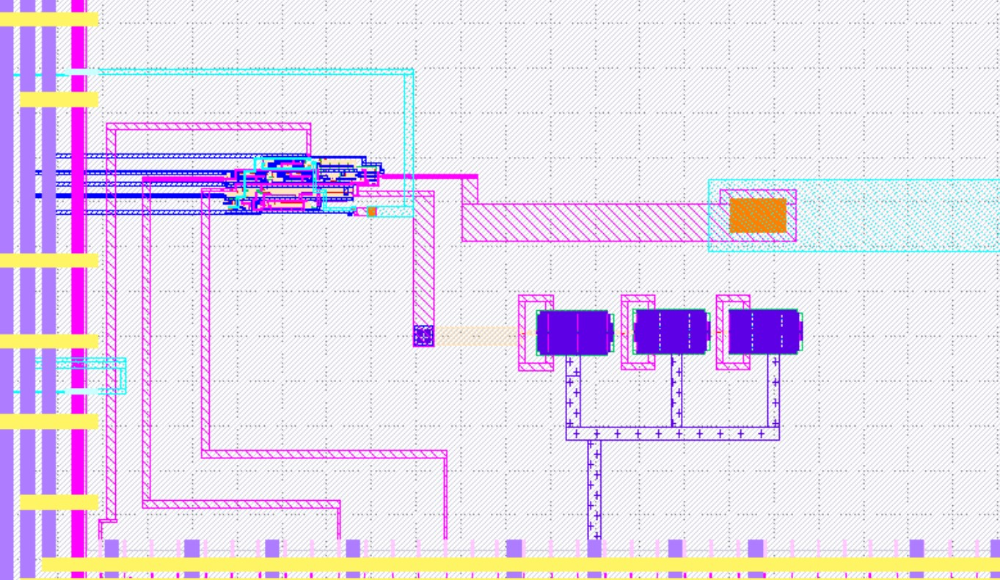
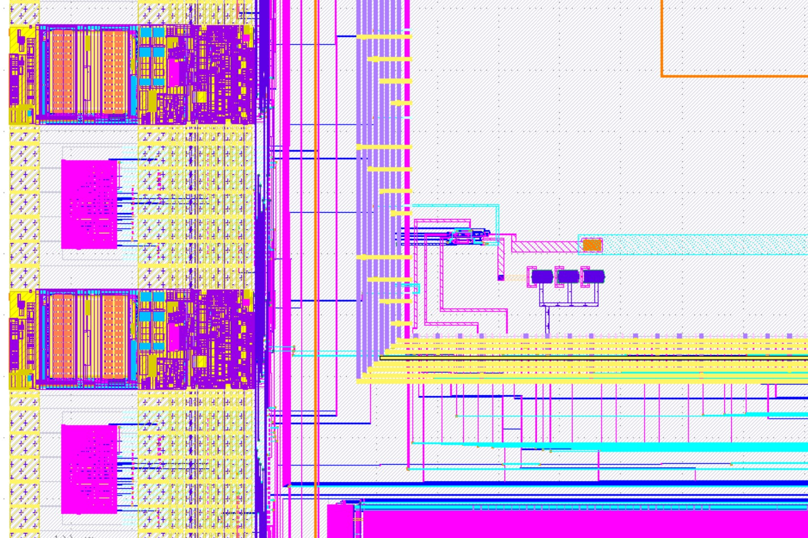
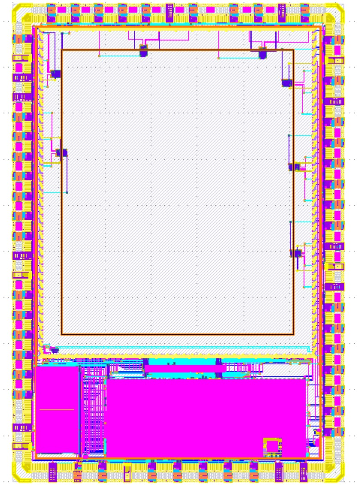

# PLL 8x Clock Multiplier IP

<h4> PLL Repo -> https://github.com/lakshmi-sathi/avsdpll_1v8 </h4>
<h4> The Caravel SoC with PLL integrated -> gds/caravel.gds.gz </h4>  
<h4> The "user_project_wrapper" containing PLL IP -> gds/user_project_wrapper.gds.gz</h4> 

<h3> PLL Pin Connections </h3>
 
 | PLL Pin | Description | Wrapper Pin |
 | --- | --- | --- |
 | REF | Input Clock | wb_clk_i |
 | ENb_VCO | VCO Enable' | wb_sel_i[[0]] |
 | ENb_CP | CP Enable', PLL/VCO Mode Select | wb_sel_i[1] |
 | VDD | Power Supply | VCCD1 |
 | GND | Ground | VSSD1 |
 | VCO_IN | VCO Direct Input | analog_io[30] |
 | CLK | Clock Output | io_out[37] |

<h3> Method Followed: </h3>

* [PLL](https://github.com/lakshmi-sathi/avsdpll_1v8) is separately layed-out in Magic (.mag) using tech-file [sky130.tech](https://github.com/lakshmi-sathi/avsdpll1v8_caravel/blob/master/sky130.tech)

* Forked and cloned [Efabless Caravel Git Repo](https://github.com/efabless/caravel)

* In the repo local root directory (bash):  
`make uncompress`  
`export PDK_ROOT=<location_of_choice>`  
`make pdk`  
(you need to have Magic > v8.3.6)

* "gds/user_project_wrapper_empty.gds" is opened in Magic and PLL cell instance is added to it 

* PLL pins are routed manually to the wrapper pins (as per the connectivity in the above table)

* This completed wrapper (.GDS) is integrated into the Caravel SoC from the repo local root directory (bash):  
`export PDK_ROOT=<same_location_as_before>`  
`make`

<h3> PLL placed and routed in User Project Wrapper </h3>

-> PLL on the left and on the right the third order loop filter

<h3> PLL in Caravel </h3>

<h4> PLL integrated Caravel SoC </h4>

 
# CIIC Harness  

Caravel is a template SoC for Google SKY130 free shuttles. It is still WIP. The current SoC architecture is given below.

 

Refer to these videos to learn more about the caravel IP and how to use it to host your design:
- Caravel User Project Features -- https://youtu.be/zJhnmilXGPo
- Aboard Caravel -- How to put your design on Caravel? -- https://youtu.be/9QV8SDelURk
- Things to Clarify About Caravel -- What versions to use with Caravel? -- https://youtu.be/-LZ522mxXMw

## Aboard Caravel:

Your area is the full user_project_wrapper, so feel free to add your project there or create a differnt macro and harden it seperately then insert it into the user_project_wrapper. For example, if your design is analog or you're using a different tool other than OpenLANE.

If you will use OpenLANE to harden your design, go through the instructions in this [README.md][0].
Else if already having hardened IP you can just place your IP and route it to the "user_project_wrapper" pins and run `make` in the repo local root directory.

You should expect hundred of thousands of magic DRC violations with the current "development" state of caravel.

## Managment SoC
The managment SoC runs firmware that can be used to:
- Configure User Project I/O pads
- Observe and control User Project signals (through on-chip logic analyzer probes)
- Control the User Project power supply

The memory map of the management SoC can be found [here](verilog/rtl/README)

## User Project Area
This is the user space. It has limited silicon area (TBD, about 3.1mm x 3.8mm) as well as a fixed number of I/O pads (37) and power pads (10).  See [the Caravel  premliminary datasheet](doc/caravel_datasheet.pdf) for details.
The repository contains a [sample user project](/verilog/rtl/user_proj_example.v) that contains a binary 32-bit up counter.   

The firmware running on the Management Area SoC, configures the I/O pads used by the counter and uses the logic probes to observe/control the counter. Three firmware examples are provided:
1. Configure the User Project I/O pads as o/p. Observe the counter value in the testbench: [IO_Ports Test](verilog/dv/caravel/user_proj_example/io_ports).
2. Configure the User Project I/O pads as o/p. Use the Chip LA to load the counter and observe the o/p till it reaches 500: [LA_Test1](verilog/dv/caravel/user_proj_example/la_test1).
3. Configure the User Project I/O pads as o/p. Use the Chip LA to control the clock source and reset signals and observe the counter value for five clock cylcles:  [LA_Test2](verilog/dv/caravel/user_proj_example/la_test2).

[0]: openlane/README.md
